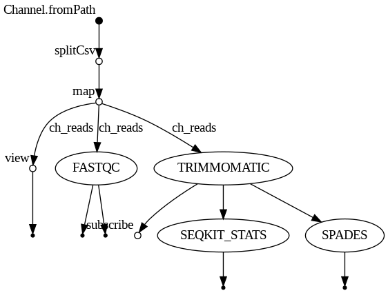

# Nextflow-functionalities

~ Amey Agarwal

>Course submission for BIOL-7210 - Instructor : Christopher Gulvik at Georgia Institute of Technology.

---

## Run the Pipeline

### 1. Install Nextflow
```bash
pip install nextflow
```

### 2. Run the Workflow
```bash
nextflow run main.nf -profile conda -with-dag dag.png -process.cpus 2
```

---

## Test Data

Test datasets are included in the repository under:
```data/```

These consist of paired-end *S. cerevisiae* RNA-seq FASTQ files used for pipeline validation and benchmarking.

---

## Environment & System Requirements

###  Operating System
- Linux
- Ubuntu 22.04
- Architecture: x86_64

### Package Manager
- Conda: `24.11.3`

### Workflow Engine
- Nextflow: `25.10.4.11173`

---

## Tools Used

The following bioinformatics tools were used in this pipeline:

| Tool | Version | Purpose |
|------|--------|--------|
| FastQC | 0.12.1 | Quality control of raw reads |
| Trimmomatic | 0.39 | Adapter trimming and quality filtering |
| SeqKit (bioconda) | 2.6.1 | FASTQ statistics and summaries |
| SPAdes (bioconda) | 3.15.5 | De novo genome assembly |
| Python (conda-forge) | 3.9 | Runtime dependency |

---

## Workflow Overview

The pipeline consists of the following steps:

1. **FastQC** → raw read quality assessment  
2. **Trimmomatic** → adapter removal and quality trimming  
3. **SeqKit** → read statistics generation  
4. **SPAdes** → de novo assembly of trimmed reads  

The workflow demonstrates:
- Sequential execution (QC → trimming)
- Parallel execution (SeqKit + SPAdes per sample)

---

## Workflow Diagram

The workflow structure is visualized using Nextflow DAG generation:



The DAG illustrates:
- Sample-wise parallel processing
- Dependency flow between pipeline stages
- Separation of QC, trimming, and assembly modules

---

## Output Structure

Results are saved in the ```results/``` directory:
```bash
results/
├── fastqc/
├── trimmomatic/
├── seqkit/
└── spades/
```
Each sample has its own subdirectory for traceability and reproducibility.

---

## Notes (learnings or observations)
- looping over data is not required -- give the data channel and format of input and output
- nf-create makes the full nextflow suite of files 
- relevant files --> modules, main.nf, nextflow.config,data
- nextflow works on the commands given to run the softwares in the triple double-qoutes
- adding a functionality and testing it is better than adding multiple at once and debugging
- passing data through channels canbe difficult and should be looked at if the pipeline is correct

